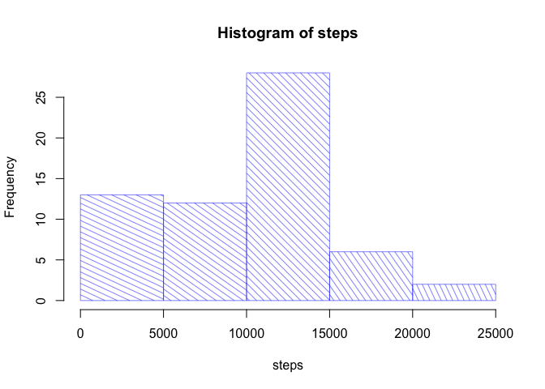
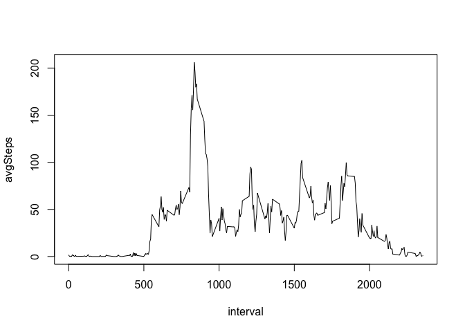
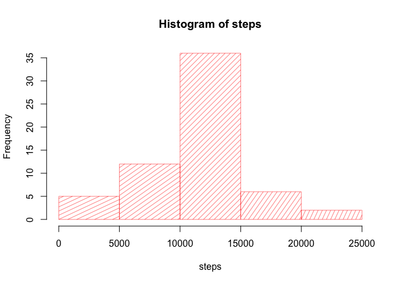
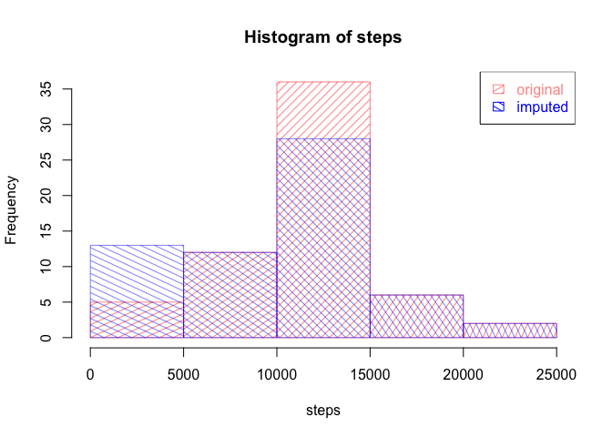

# Reproducible Research: Peer Assessment 1


## Loading and preprocessing the data

```r
activity <- read.csv("activity.csv")
```


## What is mean total number of steps taken per day?
### First, calculate the total number of steps taken each day (ignore NAs) and assign to data frame _actByDate_

```r
library(dplyr)
```

```
## 
## Attaching package: 'dplyr'
## 
## The following objects are masked from 'package:stats':
## 
##     filter, lag
## 
## The following objects are masked from 'package:base':
## 
##     intersect, setdiff, setequal, union
```

```r
actByDate <- group_by(activity, date) %>%
        summarise(steps = sum(steps, na.rm = TRUE))
```

### Next, make a histogram of the number of steps taken each day:

```r
with(actByDate, hist(steps
                     ,col=rgb(0,0,1,0.5)
                     ,angle = -15-10*1:5
                     ,density = 15
                     )
     )
```

 

### Then, calculate the mean and median number of steps take each day:

```r
meanmedian <- summarise(actByDate
                        ,dataset="Original"
                        ,mean=mean(steps)
                        ,median=median(steps)
                        )
```


## What is the average daily activity pattern?
### Find the average across all days of the number of steps by 5-minute interval and assign to data frame _actByInt_

```r
actByInt <- group_by(activity, interval) %>%
        summarise(avgSteps = mean(steps, na.rm = TRUE))
```

### Plot as a time series the average number of steps taken per 5-minute time interval

```r
with(actByInt, plot(interval, avgSteps, type = "l"))
```

 

### Find the 5-minute interval which, on average across all days in the dataset, contains the maximum number of steps

```r
maxStepInd <- with(actByInt, which.max(avgSteps))
```

### The interval with the maximum number of steps per day, on average, is

```r
paste('interval =', with(actByInt, interval[maxStepInd]))
```

```
## [1] "interval = 835"
```

```r
paste('avg # steps =', with(actByInt, avgSteps[maxStepInd]))
```

```
## [1] "avg # steps = 206.169811320755"
```
## Imputing missing values
### Calculate and report the total number of rows with NAs in teh dataset (as total number of rows - total of _complete.cases_)

```r
dim(activity)[1] - sum(complete.cases(activity))
```

```
## [1] 2304
```

### Create a new dataset _actImputed_ equal to the original _activity_ dataset but replacing NA values with mean for that 5-minute interval

```r
actImputed <- left_join(activity, actByInt) %>%
        mutate(oldsteps=steps # for troubleshooting purposes
               ,steps=ifelse(is.na(steps),avgSteps,steps)) %>%
        select(steps, date, interval) 
```

```
## Joining by: "interval"
```

### Now create the histogram and calculate the mean and median of the dataset as above, this time using the imputed dataset _actImputed_

#### *Calculate the total number of steps taken each day (ignore NAs) and assign to data frame _actImpByDate_

```r
actImpByDate <- group_by(actImputed, date) %>%
        summarise(steps = sum(steps, na.rm = TRUE))
```

#### *Next, make a histogram of the number of steps taken each day:

```r
with(actImpByDate, hist(steps
                        ,col=rgb(1,0,0,0.5)
                        ,angle = 15+10*1:5
                        ,density = 15
                        )
     )
```

 


#### *Overlaying the two histograms allows us to compare them easily:

```r
with(actImpByDate, hist(steps
                        ,col=rgb(1,0,0,0.5)
                        ,angle = 15+10*1:5
                        ,density = 15
                        )
     )
with(actByDate, hist(steps
                     ,col=rgb(0,0,1,0.5)
                     ,angle = -15-10*1:5
                     ,density = 15
                     ,add=TRUE
                     )
     )
mycols = c(rgb(1,0,0,0.5)
           ,rgb(0,0,1,1))
legend("topright"
       ,text.col = mycols
       ,border = mycols
       ,fill = mycols
       ,angle = c(15+10*1.5
                  ,-15-10*1.5)
       ,density = 15
       ,legend = c("original"
                   ,"imputed")
       )
```

 

#### *Then, calculate the mean and median number of steps take each day:

```r
meanmedianImp <- summarise(actImpByDate
                           ,dataset = "Imputed"
                           ,mean=mean(steps)
                           ,median=median(steps))
```

#### *Displaying both sets of values together, we can easily see that imputing the missing values <u>increases</u> both the mean and the median of the original dataset:

```r
rbind(meanmedian,meanmedianImp)
```

```
## Source: local data frame [2 x 3]
## 
##    dataset     mean   median
## 1 Original  9354.23 10395.00
## 2  Imputed 10766.19 10766.19
```

## Are there differences in activity patterns between weekdays and weekends?
### First create a new factor variable in the dataset with two levels -- "weekday" and "weekend"

```r
activityW <- mutate(activity
                    ,dayOfWeek = weekdays(as.Date(date))) %>%
        mutate(dayType = ifelse(dayOfWeek %in% c("Saturday"
                                                   , "Sunday")
                                  ,"weekend"
                                  ,"weekday")) %>%
        mutate(dayType = as.factor(dayType)) %>%
        group_by(dayType, interval) %>%
        summarise(avgSteps = mean(steps, na.rm = TRUE))
```

### Now create a panel plot of the time series avgSteps vs. interval, one panel for weekday and one for weekend

```r
library(lattice)
with (activityW, xyplot(avgSteps ~ interval | dayType
                        ,type = "l"
                        ,layout = c(1, 2)
                        ,ylab = "Number of steps"
                        ,xlab = "Interval"))
```

 

